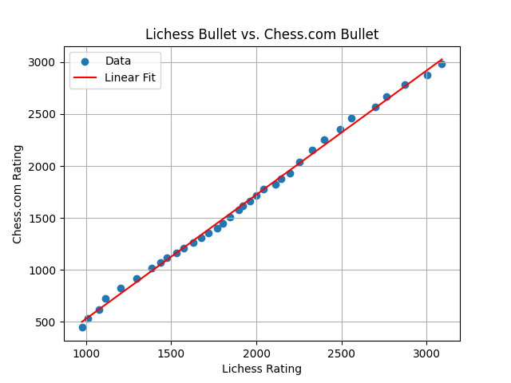

# Lichess2Chess
This is a browser extension to convert Lichess ratings to Chess.com ratings.

Does regressions from data from https://chessgoals.com/rating-comparison/ for each main chess category (Classical, Blitz, Rapid, and Bullet) and displays your equivalent Chess.com rating in Green beside your Lichess.org rating.

## Get the extension
### Firefox
https://addons.mozilla.org/en-US/firefox/addon/lichess2chess/

### Chrome:
https://chrome.google.com/webstore/detail/lichess2chess/mdjhjmefckhheleoegfcobijefkpfppo

## Examples
### See estimated ratings in game


### Predicted ratings in Green


### Actual ratings from Chess.com


## Regressions
### Bullet


### Blitz


### Rapid


### Classical


## Updating the Extension

To update the regression data and package the extension for release, you will need to have Python 3 and `pip` installed. Then, follow these steps:

1.  **Set up the virtual environment and install dependencies (only needs to be done once):**

    ```bash
    python3 -m venv .venv
    source .venv/bin/activate
    pip install -r requirements.txt
    ```

2.  **Run the update script:**

    ```bash
    ./update_extension.sh
    ```

This script will automatically fetch the latest data, recalculate the regressions, update the plots in this README, and create a `Lichess2Chess.zip` file, which is ready to be uploaded to the Chrome Web Store and Firefox Add-ons.

After running these commands, the `regressions.json` file will be updated with the latest data, and the extension will use the new values.
